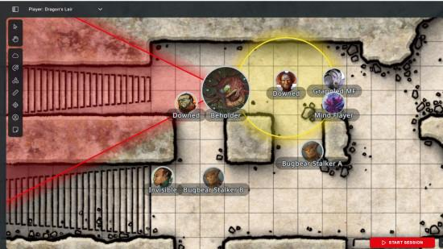
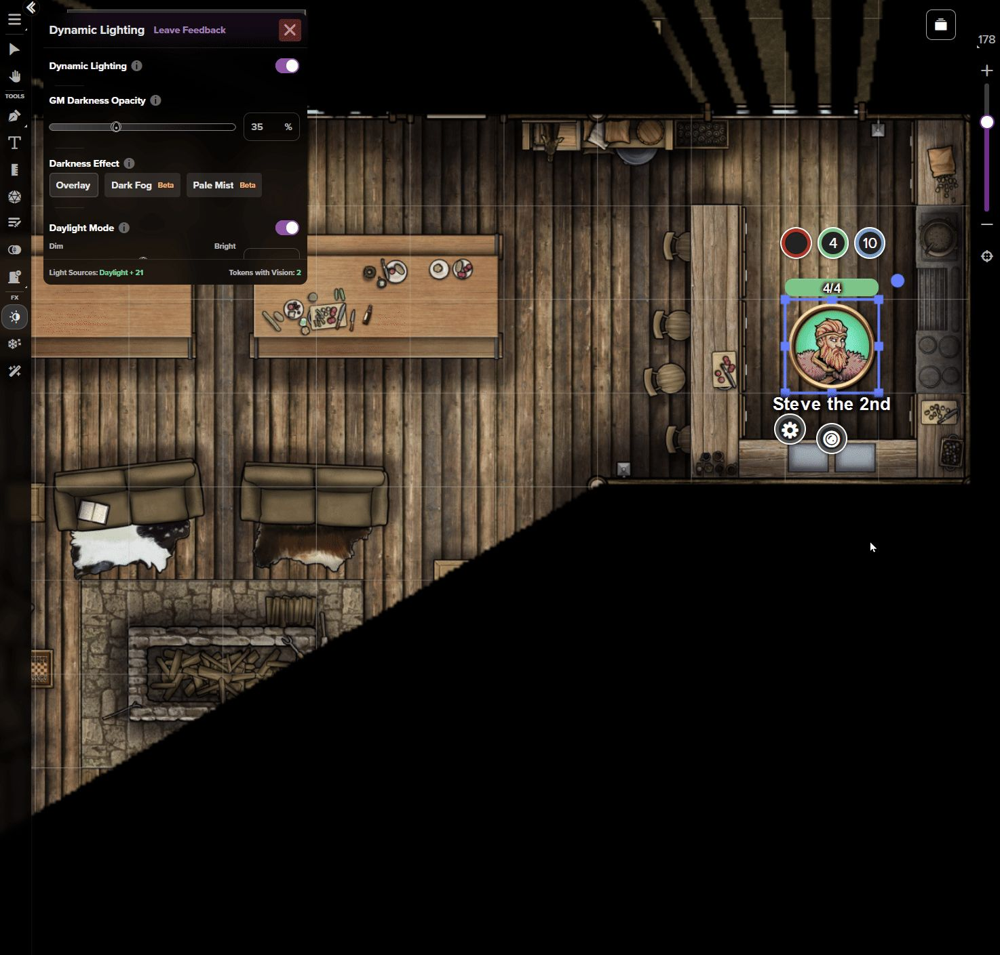

# PRD: Virtual Tabletop - A Free, Feature-Complete Virtual Tabletop

## 1. Overview

A web-based virtual tabletop (VTT) that lets tabletop RPG groups (Dungeons & Dragons and similar systems) play together remotely: a shared map, real-time token movement, fog of war, dice rolls, and turn tracking, without a subscription and without gating core features behind a paid tier.

## 2. Problem Statement

Tabletop RPG groups who play remotely today are stuck with a bad tradeoff:
- Free tools are missing core features (no fog of war, no persistent character sheets, clunky token management).
- Full-featured tools (e.g. Roll20 Pro, Foundry VTT) require a subscription or a one-time cost plus self-hosting knowledge, which is a real barrier for a casual weekly group of students or friends.
- Even the platforms that do have the advanced features gate them behind a paywall. Roll20, for example, has dynamic lighting and vision, but it's locked behind their Pro subscription tier. A group that just wants proper fog of war and line-of-sight either pays monthly for a feature that should be table stakes, or does without it.
- Groups often patch the gap with a mess of separate tools: a Discord call, a shared Google Sheet for stats, a phone app for dice, a static image for the map, which breaks immersion and loses state between sessions.

## 3. Users and User Stories

### 3.1 User Types and Roles

- **Dungeon Master (GM):** sets up the session, uploads the map, places enemies, controls fog of war, runs the game.
- **Player:** joins a session, controls their own token and character sheet, rolls dice, sees the board update live.

A typical group is one GM plus 2-6 players playing on a weekly or biweekly cadence.

Roles apply within each session: a user may be the GM in one session and a player in another.

### 3.2 User Stories

#### 3.2.1 Dungeon Master (GM)

##### GM-01: Create a Session and Invite Players

As a **GM**, I want to create a named session and share an invite code or link, so that my group can join the same game.

**Acceptance Criteria:**

- [ ] Creating a session assigns its creator the GM role.
- [ ] The session provides an invite code or link that the GM can copy.
- [ ] Users joining through the invitation receive the player role.
- [ ] The GM can reopen an existing session without recreating its setup.

##### GM-02: Set Up the Battle Map

As a **GM**, I want to upload a map image before play begins, so that the encounter is ready when players join.

**Acceptance Criteria:**

- [ ] The GM can upload a supported image format and see it on the shared board.
- [ ] Unsupported files or files exceeding the upload limit produce a clear error.
- [ ] The map remains available after users disconnect or the server restarts.
- [ ] Players see the map subject to the session’s fog-of-war settings.

##### GM-03: Manage Tokens and Ownership

As a **GM**, I want to create, position, rename, and remove tokens and assign player ownership, so that I can represent everyone involved in an encounter.

**Acceptance Criteria:**

- [ ] The GM can create tokens for players, enemies, and NPCs.
- [ ] Each token has a name and a distinguishable visual appearance.
- [ ] The GM can assign a player token to a specific session member.
- [ ] The GM can move any token; players can move only tokens assigned to them.
- [ ] Token changes appear for other participants when those tokens are visible to them.

##### GM-04: Control Fog of War

As a **GM**, I want to manually reveal and hide map regions, so that players discover the environment at the pace I choose.

**Acceptance Criteria:**

- [ ] The GM can reveal or hide regions using a basic selection tool.
- [ ] The GM can see the complete map with an indication of which regions players can see.
- [ ] Players cannot see tokens located in hidden regions.
- [ ] Fog changes update for connected players and persist between sessions.
- [ ] V1 uses GM-controlled fog; token movement does not automatically calculate visibility through walls.

##### GM-05: Manage Initiative and Turns

As a **GM**, I want to maintain a shared initiative list and advance the active turn, so that everyone knows who acts next.

**Acceptance Criteria:**

- [ ] The GM can add and remove combatants and enter or edit initiative values.
- [ ] Combatants are ordered by initiative, with the GM able to resolve ties.
- [ ] Adding or removing a combatant updates the list for everyone.
- [ ] The GM can advance to the next combatant, with the active turn clearly highlighted.
- [ ] Removing the active combatant leaves the tracker in a valid state.
- [ ] Turn tracking does not automatically resolve attacks, damage, or other game rules.

#### 3.2.2 Player

##### PL-01: Join an Invited Session

As a **player**, I want to join a session using an invite code or link, so that I can enter my group’s game with minimal setup.

**Acceptance Criteria:**

- [ ] A signed-in user can join through a valid invitation.
- [ ] An invalid invitation displays a clear error.
- [ ] Joining loads the current board, visible tokens, fog state, and initiative list.
- [ ] Rejoining restores the user’s existing membership and token assignments.

##### PL-02: Move My Assigned Token

As a **player**, I want to move my own token on the shared map, so that I can communicate my character’s position during play.

**Acceptance Criteria:**

- [ ] The player can drag an assigned token to a new position.
- [ ] The server validates ownership before accepting the movement.
- [ ] Accepted movement appears promptly for participants who can see that token.
- [ ] Attempts to move another player’s token or a GM-controlled token are rejected.
- [ ] If movement is rejected, the token returns to the server’s accepted position.

##### PL-03: Maintain My Character Sheet

As a **player**, I want to view and update my character’s basic statistics and inventory, so that I can manage my character without a separate application.

**Acceptance Criteria:**

- [ ] The sheet includes character name, current and maximum HP, basic statistics, and inventory fields.
- [ ] Changes are saved and restored when the player rejoins.
- [ ] Players can edit only character sheets they own.
- [ ] Invalid numeric entries produce a clear validation message.
- [ ] Inventory and other descriptive fields support plain text; automated rules and calculations are outside v1.

##### PL-04: See the Encounter from the Player’s Perspective

As a **player**, I want to see revealed map areas and visible tokens, so that I can make decisions using the information the GM has shared.

**Acceptance Criteria:**

- [ ] Hidden map regions remain covered by fog.
- [ ] Hidden enemies and NPCs do not appear in the player’s board view.
- [ ] GM reveal and hide actions update the player’s view during play.
- [ ] Reconnecting preserves the current visibility restrictions.

##### PL-05: Follow the Turn Order

As a **player**, I want to see the initiative list and active combatant, so that I know when to prepare and take my turn.

**Acceptance Criteria:**

- [ ] The initiative list displays the combatants and their order.
- [ ] The current turn is clearly highlighted.
- [ ] GM changes appear without requiring a page refresh.
- [ ] Players can view the tracker but cannot change its order or advance turns.

#### 3.2.3 Shared Stories: All Users

##### US-01: Access My Account and Sessions

As **any user**, I want to create an account, sign in, and find sessions I belong to, so that I can return to ongoing games.

**Acceptance Criteria:**

- [ ] Users can register, sign in, and sign out.
- [ ] Signed-in users can see their existing sessions and their role in each.
- [ ] Session data is accessible only to authorized members.
- [ ] Signing out ends access to protected session actions.

##### US-02: Roll Shared Dice

As **any user**, I want to roll standard tabletop dice and share the result, so that the group can resolve actions using a common record.

**Acceptance Criteria:**

- [ ] The roller supports d4, d6, d8, d10, d12, d20, and d100.
- [ ] Users can choose a quantity and an optional numeric modifier, such as `2d6 + 3`.
- [ ] The server generates the result and distributes the same result to session members.
- [ ] Each entry shows the roller’s name, dice expression, individual results, total, and timestamp.
- [ ] Roll results are retained in the session history.

##### US-03: Send In-Session Messages

As **any user**, I want to send text messages to the session, so that the group can share notes and discuss actions alongside the board.

**Acceptance Criteria:**

- [ ] Messages show the sender’s name and timestamp.
- [ ] Messages appear for connected members of the same session.
- [ ] Empty messages are rejected.
- [ ] Saved messages remain available after reconnecting.
- [ ] Messages from one session never appear in another.

##### US-04: Resume After a Disconnect

As **any user**, I want to reconnect and recover the current game state, so that connection problems do not erase progress.

**Acceptance Criteria:**

- [ ] The interface indicates when the connection is lost and when it is restored.
- [ ] After reconnecting, the client loads the server’s current state.
- [ ] Updates made by other users during the disconnection are reflected.
- [ ] An outdated client does not overwrite newer session state.
- [ ] Actions that were not confirmed as saved are clearly identified.

##### US-05: Continue the Game on Another Day

As **any user**, I want the session’s saved state to survive everyone leaving and the server restarting, so that our group can continue a campaign across multiple meetings.

**Acceptance Criteria:**

- [ ] The map, token positions and ownership, fog, character sheets, initiative state, chat, and dice history are persisted.
- [ ] Reopening the session restores its last successfully saved state.
- [ ] Saving failures are communicated to affected users.

##### US-06: Share a Consistent Board

As **any user**, I want accepted actions to produce a consistent state across participants, so that we can rely on the shared board during play.

**Acceptance Criteria:**

- [ ] The server validates session membership and action permissions.
- [ ] Simultaneous actions are processed in a defined order.
- [ ] Conflicting edits to the same object resolve to one authoritative result.
- [ ] Connected clients receive the accepted updates, subject to their visibility permissions.
- [ ] Actions and updates remain isolated to their session.

*Reference mockup showing token conditions (Downed, Invisible), grouped enemy tokens, and area overlays, the kind of in-session view v1 is aiming for.*

*Reference mockup of dynamic lighting/fog of war, a feature that platforms like Roll20 lock behind a paid tier.*

## 4. Goals

- A GM should be able to set up a session (map, enemies, fog of war) once, and players should be able to join, see the board update live, move their own tokens, track their own stats, and roll dice, all in one place, for free.
- No feature in v1 is paywalled or tiered. If it ships, everyone gets it.

## 5. Why This Requires a Semester 

This is not a CRUD app with a chat window bolted on. The hard parts are systemic:

- **Real-time shared state across clients.** When a player moves a token, every other connected client (including the GM's) must see it update immediately, and the server must resolve what happens if two people act at once (e.g. two players trying to move through the same square, or the GM updating fog of war while a player moves).
- **Authoritative state and reconnection.** If a player's laptop dies mid-session, they need to reconnect and see the *current* board state, not a stale one, meaning the server (not the client) has to be the source of truth, and clients need to reconcile on reconnect.
- **Role-based permissions in real time.** GMs and players see different things (the GM sees the whole map; players see only what's revealed by fog of war) and can perform different actions. This isn't just a login gate, it's per-object, per-session authorization enforced live.
- **Fog of war computation.** Determining what's "visible" from a token's position given walls/obstacles is a real (if bounded) computational geometry problem, not a static image toggle.
- **Persistent session data.** Maps, tokens, character stats, and session history need to survive across days/weeks of play, not just a single browser tab.
- **Scaling to multiple concurrent sessions.** Many GM/player groups running independent sessions simultaneously, each with its own isolated real-time channel.

Any one of these is a solid systems problem; together they require an actual architecture, not a single AI-generated pass.

## 6. Requirements (In v1)

- User accounts (GM and player roles)
- Create / join a session (via invite code or link)
- GM: upload a map image, place and move enemy/NPC tokens
- Players: move their own token in real time, visible to everyone in the session
- Basic fog of war (GM-controlled reveal/hide regions)
- Turn order tracker (initiative list, shared and synced)
- Dice roller (standard polyhedral dice, results visible to the whole session)
- Basic character stat sheet (HP, stats, inventory as plain fields)
- Session persistence (state survives disconnect/reconnect and server restarts)
- In-session text chat

## 7. Non-Goals (Explicitly Out of v1)

- Voice/video chat (use Discord alongside it, not our problem to solve)
- Mobile native app (web-responsive only)
- Marketplace for maps/assets or paid content
- Custom rule-engine / automated combat resolution
- Scripting/macros for character sheets
- 3D rendering or dynamic lighting beyond basic fog of war
- Plugin ecosystem / third-party extensions

