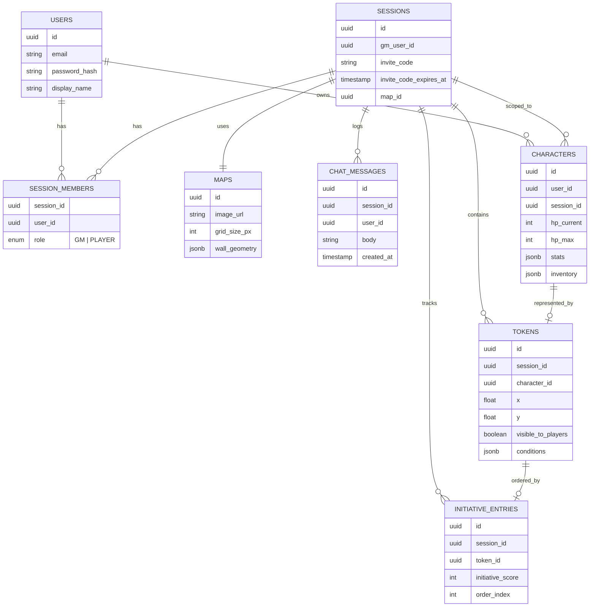
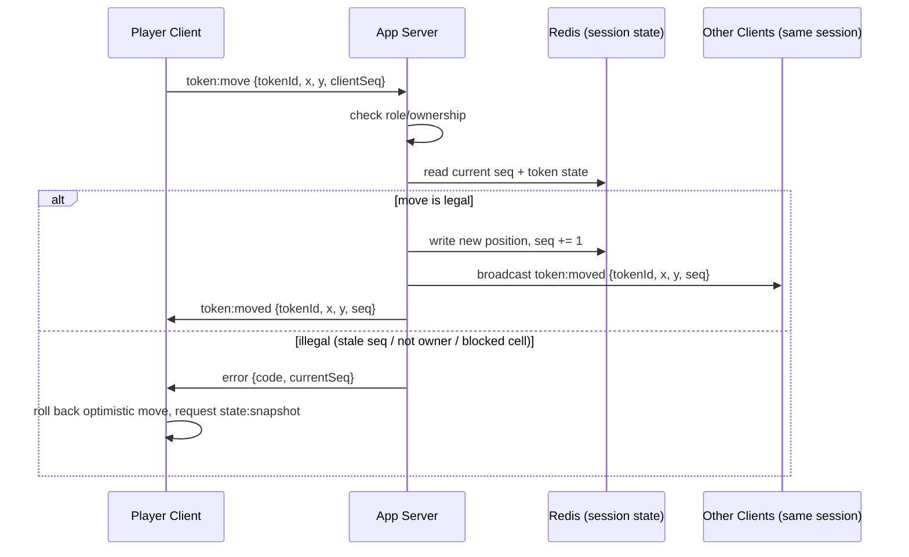
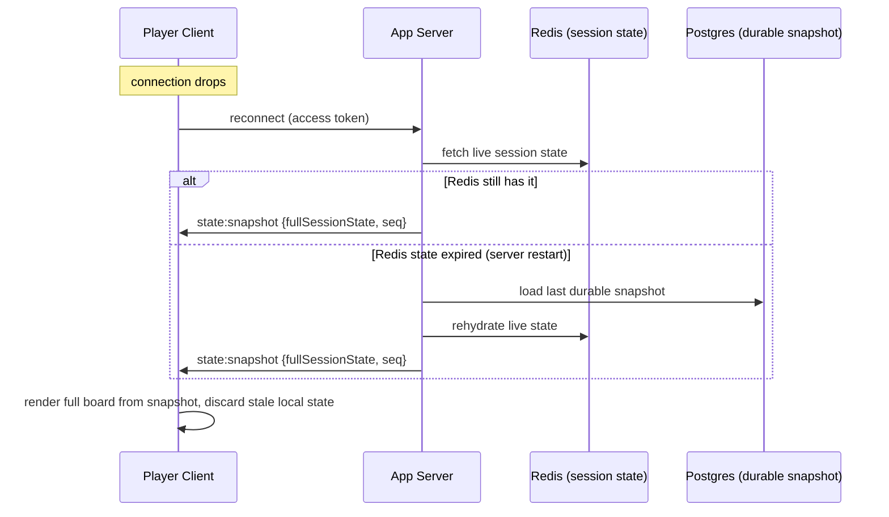

# PRD: Virtual Tabletop - A Free, Feature-Complete Virtual Tabletop

## 1. Overview

A web-based virtual tabletop (VTT) that lets tabletop RPG groups (Dungeons & Dragons and similar systems) play together remotely: a shared map, real-time token movement, fog of war, dice rolls, and turn tracking, without a subscription and without gating core features behind a paid tier.

## 2. Problem Statement

Tabletop RPG groups who play remotely today are stuck with a bad tradeoff:
- Free tools are missing core features (no fog of war, no persistent character sheets, clunky token management).
- Full-featured tools (e.g. Roll20 Pro, Foundry VTT) require a subscription or a one-time cost plus self-hosting knowledge, which is a real barrier for a casual weekly group of students or friends.
- Even the platforms that do have the advanced features gate them behind a paywall. Roll20, for example, has dynamic lighting and vision, but it's locked behind their Pro subscription tier. A group that just wants proper fog of war and line-of-sight either pays monthly for a feature that should be table stakes, or does without it.
- Groups often patch the gap with a mess of separate tools: a Discord call, a shared Google Sheet for stats, a phone app for dice, a static image for the map, which breaks immersion and loses state between sessions.

## 3. Users

**Primary users:**
- **Dungeon Master (GM):** sets up the session, uploads the map, places enemies, controls fog of war, runs the game.
- **Player:** joins a session, controls their own token and character sheet, rolls dice, sees the board update live.

A typical group is one GM plus 2-6 players playing on a weekly or biweekly cadence.

## 4. Goals

- A GM should be able to set up a session (map, enemies, fog of war) once, and players should be able to join, see the board update live, move their own tokens, track their own stats, and roll dice, all in one place, for free.
- No feature in v1 is paywalled or tiered. If it ships, everyone gets it.

## 5. Why This Requires a Semester 

This is not a CRUD app with a chat window bolted on. The hard parts are systemic:

- **Real-time shared state across clients.** When a player moves a token, every other connected client (including the GM's) must see it update immediately, and the server must resolve what happens if two people act at once (e.g. two players trying to move through the same square, or the GM updating fog of war while a player moves).
- **Authoritative state and reconnection.** If a player's laptop dies mid-session, they need to reconnect and see the *current* board state, not a stale one, meaning the server (not the client) has to be the source of truth, and clients need to reconcile on reconnect.
- **Role-based permissions in real time.** GMs and players see different things (the GM sees the whole map; players see only what's revealed by fog of war) and can perform different actions. This isn't just a login gate, it's per-object, per-session authorization enforced live.
- **Fog of war computation.** Determining what's "visible" from a token's position given walls/obstacles is a real (if bounded) computational geometry problem, not a static image toggle.
- **Persistent session data.** Maps, tokens, character stats, and session history need to survive across days/weeks of play, not just a single browser tab.
- **Scaling to multiple concurrent sessions.** Many GM/player groups running independent sessions simultaneously, each with its own isolated real-time channel.

Any one of these is a solid systems problem; together they require an actual architecture, not a single AI-generated pass.

## 6. Requirements (In v1)

- User accounts (GM and player roles)
- Create / join a session (via invite code or link)
- GM: upload a map image, place and move enemy/NPC tokens
- Players: move their own token in real time, visible to everyone in the session
- Basic fog of war (GM-controlled reveal/hide regions)
- Turn order tracker (initiative list, shared and synced)
- Dice roller (standard polyhedral dice, results visible to the whole session)
- Basic character stat sheet (HP, stats, inventory as plain fields)
- Session persistence (state survives disconnect/reconnect and server restarts)
- In-session text chat

## 7. Non-Goals (Explicitly Out of v1)

- Voice/video chat (use Discord alongside it, not our problem to solve)
- Mobile native app (web-responsive only)
- Marketplace for maps/assets or paid content
- Custom rule-engine / automated combat resolution
- Scripting/macros for character sheets
- 3D rendering or dynamic lighting beyond basic fog of war
- Plugin ecosystem / third-party extensions

## 8. User Stories

- As a **GM**, I want to upload a map and place enemy tokens, so that I can set up an encounter before my players join.
- As a **GM**, I want to control what's hidden behind fog of war, so that I can reveal the map at the pace I want without giving away the whole dungeon.
- As a **player**, I want to move my token and have it appear instantly for everyone else, so that combat feels responsive instead of laggy or turn-based-only.
- As a **player**, I want to roll dice and have the result visible to the whole group, so that no one has to trust a private roll.
- As a **GM**, I want the turn order to update automatically as I add/remove combatants, so that I don't have to track initiative on paper.
- As **any user**, I want to close my laptop mid-session and rejoin later without losing the board state, so that a bad connection doesn't ruin the session.
- As a **player**, I want a simple character sheet I can update during play, so that I don't need a separate app for my stats.


*Reference mockup showing token conditions (Downed, Invisible), grouped enemy tokens, and area overlays, the kind of in-session view v1 is aiming for.*


*Reference mockup of dynamic lighting/fog of war, a feature that platforms like Roll20 lock behind a paid tier.*

## 9. Technical Architecture

```
                         ┌─────────────────────┐
                         │   Web Client (React) │
                         │  - board canvas       │
                         │  - token drag/drop    │
                         │  - dice / turn UI      │
                         └──────────┬────────────┘
                                    │ WebSocket (state sync)
                                    │ REST (auth, session CRUD, asset upload)
                         ┌──────────▼────────────┐
                         │   App Server (Node)    │
                         │  - session manager     │
                         │  - permission checks   │
                         │  - fog-of-war calc     │
                         └───┬───────────────┬────┘
                             │               │
                  ┌──────────▼───┐   ┌───────▼────────┐
                  │  Postgres     │   │  Redis          │
                  │  (persistent: │   │  (ephemeral:    │
                  │  users, maps, │   │  live session   │
                  │  characters)  │   │  state, pub/sub │
                  │               │   │  across server  │
                  │               │   │  instances)     │
                  └───────────────┘   └─────────────────┘
                             │
                  ┌──────────▼───────┐
                  │  Object storage   │
                  │  (S3 / MinIO)     │
                  │  (map images)     │
                  └───────────────────┘
```

**Key design decision to flag:** the server is authoritative for game state (token positions, fog, turn order). Clients send *intents* ("move token X to (a,b)"), the server validates and broadcasts the resulting state. This is what makes reconnection, permission enforcement, and conflict resolution tractable.

Map images and other static assets go in an S3-compatible object store. MinIO works well here since it's self-hostable (no cloud account needed for local dev or demo day) and speaks the same API as S3, so the code isn't locked to one provider.

**Stack choices (pinned for v1):**

| Layer | Choice | Why |
|---|---|---|
| Board rendering | **Konva.js** (`react-konva`) | Layer-based scene graph with hit detection and drag events built in — most of "token drag/drop" is then configuration, not hand-rolled canvas math. |
| Real-time transport | **Socket.IO** (not raw `ws`) | Session-scoped "rooms" map 1:1 onto VTT sessions; built-in reconnection/ack semantics remove a chunk of the reconnection work called out in §5. |
| App server | **Node.js + Express**, Socket.IO server in the same process | One deployable per instance; REST and WS share auth middleware. |
| ORM | **Prisma** over Postgres | Typed queries and migrations matter more here than raw SQL control, given the schema will change every phase. |
| Auth | Short-lived **JWT** access token (15 min) + httpOnly refresh cookie (7 days) | WS handshake carries the access token; no server-side session store needed for auth itself. |
| Object storage | **MinIO** (S3-compatible) | Already decided above — self-hostable, same API as AWS S3. |

### 9.1 Data Model



`wall_geometry` on `MAPS` and `conditions`/`stats`/`inventory` on `TOKENS`/`CHARACTERS` are JSONB because their shape is genuinely variable (different systems track different stats) and doesn't need to be queried relationally in v1 — normalizing them now would be speculative.

### 9.2 API & WebSocket Protocol

**REST** (auth, session lifecycle, asset upload — anything that isn't live game state):

| Method | Path | Auth | Purpose |
|---|---|---|---|
| POST | `/api/auth/register` | none | Create a user account |
| POST | `/api/auth/login` | none | Issue access + refresh tokens |
| POST | `/api/auth/refresh` | refresh cookie | Rotate access token |
| POST | `/api/sessions` | GM | Create a session |
| POST | `/api/sessions/:id/join` | user + invite code | Join a session as a player |
| GET | `/api/sessions/:id` | member | Session metadata (map ref, members, roles) |
| POST | `/api/sessions/:id/maps` | GM | Upload a map image (multipart → object storage) |
| GET | `/api/sessions/:id/characters/:userId` | member | Fetch a character sheet |
| PUT | `/api/sessions/:id/characters/:userId` | owner or GM | Update a character sheet |
| GET | `/api/sessions/:id/history` | member | Paginated chat/event log |

**WebSocket** (one Socket.IO room per session; everything here is live game state):

Client → Server (*intents* — the server may reject any of these):

| Event | Payload | Notes |
|---|---|---|
| `token:move` | `{tokenId, x, y, clientSeq}` | Player can only move tokens they own; GM can move any. |
| `token:create` | `{mapId, x, y, imageRef, isNpc}` | GM only. |
| `fog:reveal` / `fog:hide` | `{regionCells: [[x,y], ...]}` | GM only. |
| `turn:advance` | `{}` | GM only. |
| `initiative:set` | `{entries: [{tokenId, score}]}` | GM only. |
| `dice:roll` | `{expression}` | e.g. `"2d6+3"`; any member. |
| `chat:send` | `{body}` | Any member. |
| `character:update` | `{characterId, patch}` | Owner or GM. |

Server → Client (*facts* — clients render these, they don't re-derive them):

| Event | Payload | Notes |
|---|---|---|
| `state:snapshot` | `{fullSessionState, seq}` | Sent on connect/reconnect. |
| `token:moved` | `{tokenId, x, y, seq}` | Broadcast to the room after an accepted `token:move`. |
| `fog:updated` | `{revealedCells, seq}` | Diff, not the full fog state. |
| `turn:advanced` | `{currentIndex, seq}` | |
| `dice:result` | `{userId, expression, rolls, total}` | Broadcast so no roll is private. |
| `chat:message` | `{userId, body, ts}` | |
| `error` | `{code, message, currentSeq}` | Sent only to the sender of a rejected intent. |

### 9.3 Real-Time Sync & Conflict Resolution

Each session has a monotonically increasing `seq` counter in Redis. The flow for every client intent:

1. Client applies the change optimistically (renders the token move immediately) and sends the intent tagged with the last `seq` it saw.
2. Server checks authorization (role + ownership) against `session_members`/`tokens`.
3. Server validates the intent against current authoritative state (e.g. token belongs to sender, target cell isn't blocked).
4. If valid: write to Redis, increment `seq`, publish the resulting event on the session's Redis pub/sub channel — every app-server instance with sockets in that room forwards it to its local clients.
5. If invalid: send `error` only to the sender with the current authoritative `seq`, so the client can discard its optimistic change and re-request `state:snapshot` instead of guessing what the "real" state is.

This is optimistic-apply-then-reconcile, not last-write-wins: the server never merges two conflicting writes, it accepts one and rejects the other, and rejection is explicit and observable by the client.



Reconnection uses the same authoritative source rather than trying to replay missed events — replaying a diff stream correctly across an unknown-length disconnect is much harder than just re-sending the current snapshot:



### 9.4 Fog of War

v1 ships the requirement in §6 as written: **GM-painted reveal/hide regions** — the GM selects grid cells to reveal or hide, stored as a set of revealed-cell coordinates per session, diffed and broadcast via `fog:updated`. This is deliberately simpler than true per-token line-of-sight and is well within a semester's first pass.

The mockup in §8 (dynamic lighting) shows the harder version: visibility computed *from each token's position* against wall geometry, recomputed as tokens move. That's out of v1 per §7 ("3D rendering or dynamic lighting beyond basic fog of war"), and it's called out again in §11 as the first stretch goal if earlier phases land on schedule — it's the single biggest differentiator vs. free competitors, so it's worth reserving time for rather than pretending it's free. The algorithm for it, when tackled, is **recursive shadowcasting** against the `wall_geometry` segments on `MAPS`: well-documented, bounded by grid radius, and avoids the cost of full polygon-clipping visibility.

### 9.5 Horizontal Scaling

No sticky sessions are required because live state lives in Redis, not in server-process memory. Mechanically:

- A session's live state and pub/sub channel are keyed by `session:{sessionId}`.
- Any app-server instance can serve any session's REST calls.
- When a socket joins a session's Socket.IO room, that instance subscribes to `session:{sessionId}` on Redis (if not already subscribed) and unsubscribes when the last local socket for that session leaves.
- An accepted intent is published once to `session:{sessionId}`; every subscribed instance forwards it to its own local sockets in that room.

This means the WS layer scales by adding instances behind a plain round-robin load balancer — no session-affinity routing to build or maintain.

### 9.6 Security & Authorization Model

- REST: JWT access token in the `Authorization` header, validated by middleware; refresh via httpOnly cookie.
- WS: access token presented at handshake; the server resolves and caches `{userId, sessionId, role}` from `session_members` for that socket.
- Every GM-only WS event (`fog:reveal`, `token:create`, `turn:advance`, `initiative:set`) re-checks role **per message**, not just at handshake — role is data, not a connection property, so it can't be assumed to stay valid for the socket's lifetime.
- Invite codes are random 8-character base32 strings tied to a `sessionId`, with an expiry timestamp the GM can shorten or revoke.
- Per-socket rate limiting (token-bucket) on `token:move` and `dice:roll` to bound abuse from a single client.

## 10. Non-Functional Requirements

| Requirement | Target |
|---|---|
| Move-to-render latency | p95 < 150ms on a typical broadband connection, within one session |
| Reconnect time | Full board state rendered within 2s of a successful reconnect |
| Concurrent sessions (v1 target) | 50 sessions, ~4 players each (≈200 concurrent sockets) on a single small instance |
| Durability | No data loss on a server restart — live Redis state must be backed by a Postgres snapshot, not memory alone |
| Map upload size | 20MB cap per image, enforced server-side |
| Uptime | Best-effort for a semester demo; no formal SLA |

## 11. Milestones / Timeline

| Phase | Weeks | Deliverable |
|---|---|---|
| 1 | 1–3 | Auth, session CRUD, static board render (no real-time sync yet) |
| 2 | 4–6 | WebSocket sync online: server-authoritative token moves, reconnection via snapshot |
| 3 | 7–9 | GM-painted fog of war, turn/initiative tracker, dice roller |
| 4 | 10–12 | Persistence hardening, character sheets, in-session chat |
| 5 | 13–14 | Polish, load test against §10 targets, demo prep |
| Stretch | if ahead of schedule | Per-token dynamic line-of-sight (recursive shadowcasting), multi-instance scaling test |

This is what backs the claim in §5 — each bullet there maps to a specific phase above, not an open-ended aspiration.

## 12. Risks & Open Questions

| Risk | Impact | Mitigation |
|---|---|---|
| Fog-of-war recompute cost on large maps | Laggy reveal for the GM | Coarse grid cells, not per-pixel; benchmark early in Phase 3 |
| WS scaling beyond one instance is untested | The scaling claim in §5/§9.5 is unproven until tried | Explicit multi-instance load test in Phase 5 (see §11) |
| Canvas performance with many tokens | Dropped frames on drag with a large encounter | Cap v1 at ~40 tokens/session; revisit if needed |
| Disconnect mid-move | Client could render inconsistent state | Always resync via full `state:snapshot` rather than replaying missed diffs (§9.3) |
| Mockup in §8 implies dynamic lighting is in v1 | Mismatched expectations at demo | §7 already excludes it explicitly; keep demo framing consistent with that |

## 13. Testing Strategy

- **Unit:** fog-of-war region math, permission-check middleware, dice-expression parser.
- **Integration:** WS message flow (send intent → assert broadcast + persisted Redis/Postgres state), REST auth flows.
- **Load:** simulate N concurrent sessions with M sockets each firing `token:move` at a fixed rate; measure broadcast latency against the §10 target (Phase 5).
- **Manual:** one pass per phase against the user stories in §8.